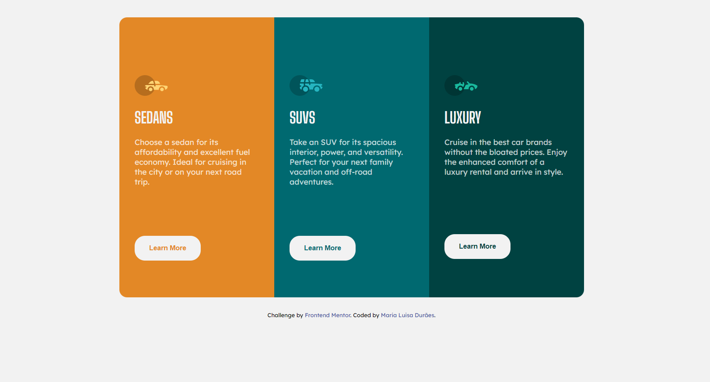

# Frontend Mentor - 3-column preview card component solution

This is a solution to the [3-column preview card component challenge on Frontend Mentor](https://www.frontendmentor.io/challenges/3column-preview-card-component-pH92eAR2-).

You can view my solution page here [3-column preview card component by Maria Luisa](https://marialuisamd.github.io/Frontend_Mentor/3_COLUMN_PREVIEW_CARD_COMPONENT)

# My solution

# About the challenge

Users should be able to:
 - View the optimal layout depending on their device's screen size
 - See hover states for interactive elements

# Build whith

- HTML
- CSS

