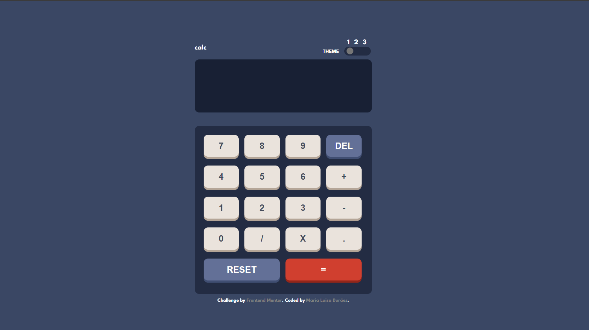

# Frontend Mentor - Calculator app solution

This is a solution to the [Calculator app challenge on Frontend Mentor](https://www.frontendmentor.io/challenges/calculator-app-9lteq5N29)

You can view my solution page here [Calculator app by Maria Luisa](https://marialuisamd.github.io/Frontend_Mentor/CALCULATOR_APP)

# About the challenge
Users should be able to:

- See the size of the elements adjust based on their device's screen size
- Perform mathmatical operations like addition, subtraction, multiplication, and division
- Adjust the color theme based on their preference

# Build whith

- HTML
- CSS
- JavaScript
- SASS

# My Solution

