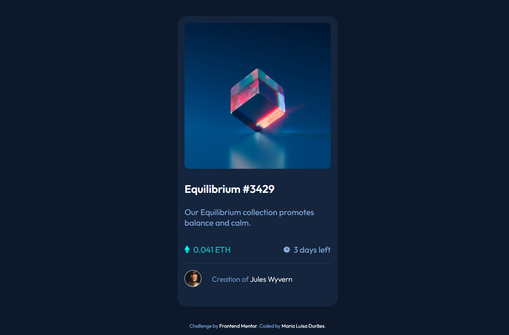

# Frontend Mentor - NFT preview card component solution

This is a solution to the [NFT preview card component challenge on Frontend Mentor](https://www.frontendmentor.io/challenges/nft-preview-card-component-SbdUL_w0U)

You can view my solution page here [NFT preview card by Maria Luisa](https://marialuisamd.github.io/Frontend_Mentor/NFT_PREVIEW_CARD_COMPONENT/)

# My solution

# About the challenge

Your challenge is to build out this preview card component as close to the design as possible.

Your users should be able to:

 - View the optimal layout depending on their device's screen size
 - See hover states for interactive elements

# Build whith

- HTML
- CSS

