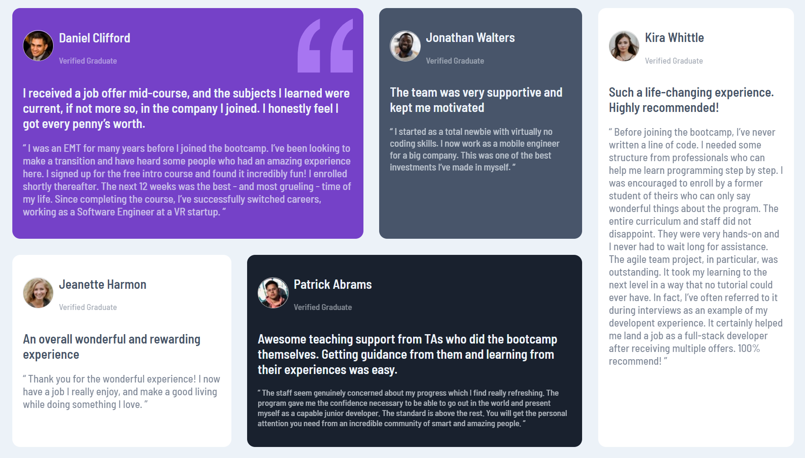

# Frontend Mentor - Testimonials grid section solution

This is a solution to the [Testimonials grid section challenge on Frontend Mentor](https://www.frontendmentor.io/challenges/testimonials-grid-section-Nnw6J7Un7)

You can view my solution page here [Product preview card component by Maria Luisa](https://marialuisamd.github.io/Frontend_Mentor/TESTIMONIALS_GRID_SECTION)

# My solution

# About the challenge

Your challenge is to build out this testimonials grid section and get it looking as close to the design as possible.

Your users should be able to:

 - View the optimal layout for the site depending on their device's screen size

# Build whith

- HTML
- CSS
- SASS